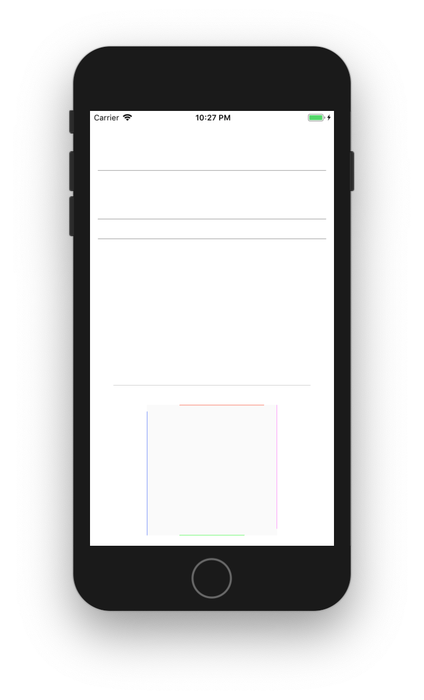

# LDOHairlineBorderView

[](https://cocoapods.org/pods/LDOHairlineBorderView)
[](https://cocoapods.org/pods/LDOHairlineBorderView)
[](https://cocoapods.org/pods/LDOHairlineBorderView)



## Description

The borders...

- are _always_ [1px wide](Screenshots/Hairlines.png), on retina and non-retina devices.
- are pixel aligned and _not_ blurry (except maybe on the [downsampled Plus phones](https://www.paintcodeapp.com/news/iphone-6-screens-demystified))
- can be activated separately on each side.
- can be jointly and independently configured
  - more specific properties override more general settings.
  - see [header for a list of available properties](https://github.com/lurado/LDOHairlineBorderView/blob/master/LDOHairlineBorderView/Classes/LDOHairlineBorderViewLite.h)


### Interface Builder Support

All properties can be edited in Interface Builder.

While `LDOHairlineBorderView` uses `IBInspectable`, it does _not_ support `IB_DESIGNABLE`, because it seems that Interface Builder still struggles rendering those views properly.

Apparently even many `IBInspectable` properties can cause Interface Builder performance issues. To mitigate such problems, there's also `LDOHairlineBorderViewLite` with only the minimum of inspectable properties. Try to use it whenever possible, if Interface Builder starts slogging.

## Example

To run the example project, clone the repo, and run `pod install` from the Example directory first.

## Installation

LDOHairlineBorderView is available through [CocoaPods](https://cocoapods.org). To install
it, simply add the following line to your Podfile:

```ruby
pod 'LDOHairlineBorderView'
```

## Author

Raschke & Ludwig GbR, https://www.lurado.com/

## License

LDOHairlineBorderView is available under the MIT license.
See the [LICENSE](LICENSE) file for more information.
